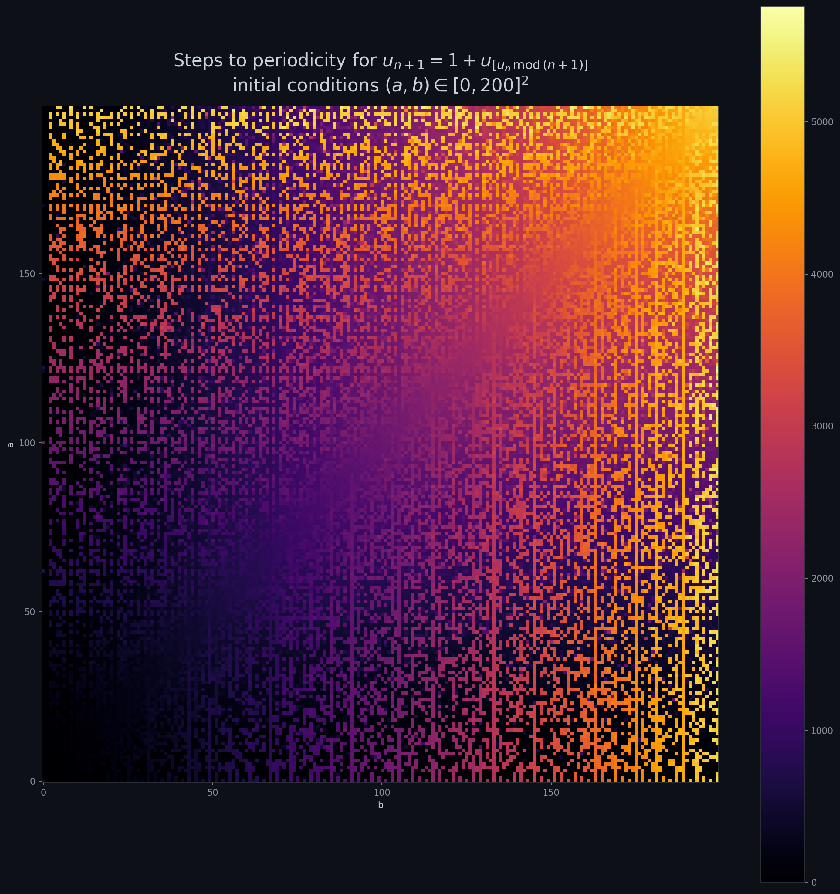
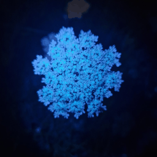
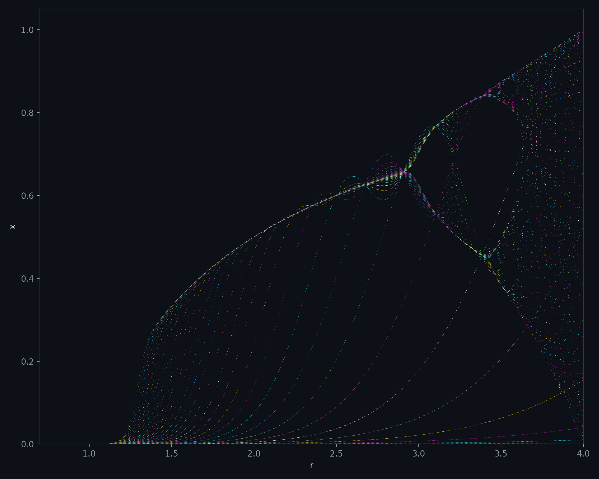
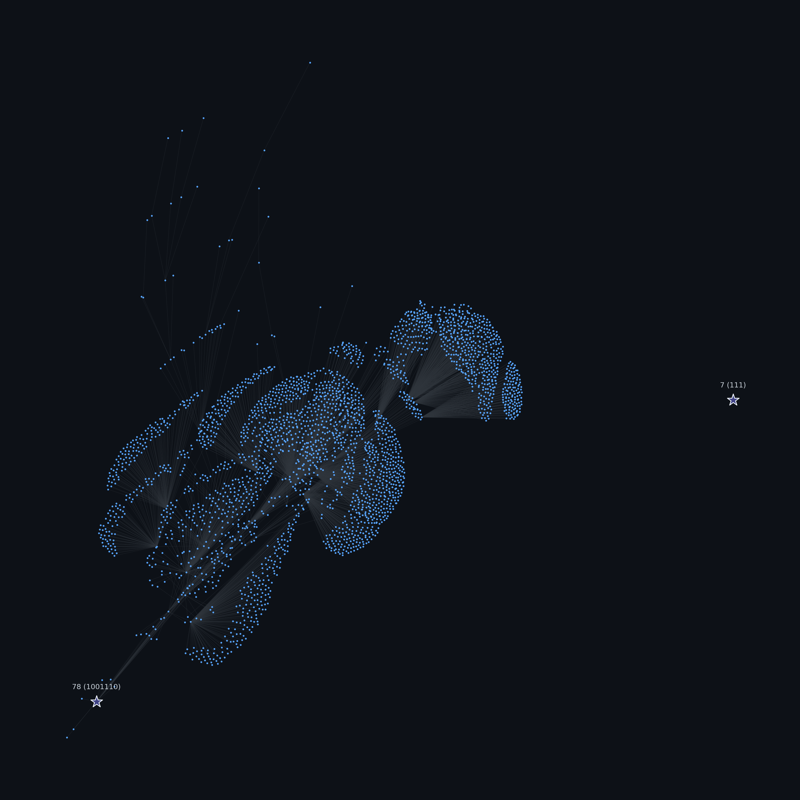
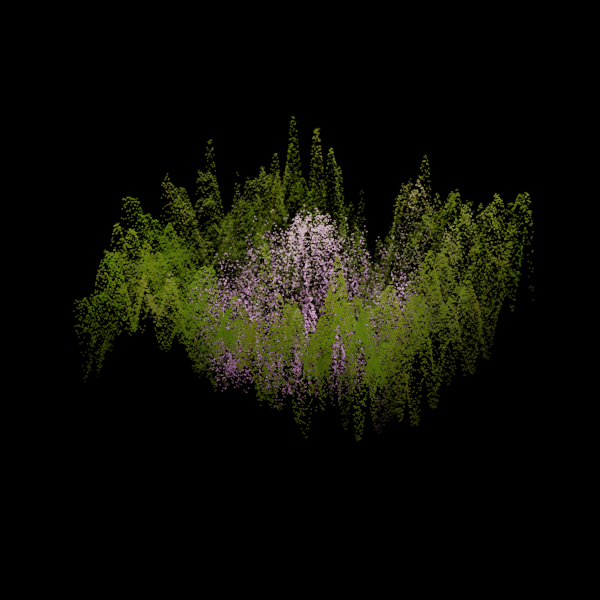
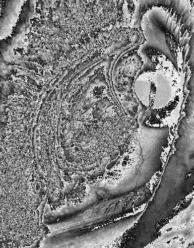

# Explorations

Math, simulations, and generative visuals — built to answer a curiosity or to make something that looks good, often both.

Each folder is a self-contained project with its own README, code, and results.

---

## Gallery

<!-- Add projects here as they come:

**Project Title** — one-line description.

-->

**Meta-Recurrence** — self-referential sequence $u_{n+1} = u_{u_n \bmod (n+1)} + 1$ and its fractal-like convergence landscape.

**Feedback Loop** — repeatedly re-encoding/decoding an image through a Stable Diffusion VAE until it hallucinates itself into noise.

**Logistic Transients** — a plotting bug that showed the logistic map's pre-convergence transient instead of its attractor, and looked better for it.

**Pea Pattern** — a look-and-say variant where, in binary, every number converges to one of only two fixed points.

**Picture Effects** — three small image effects (modulo-striped contours, gradient-driven dot drift, PCA-height terrain) run on the same eye and flower photos.