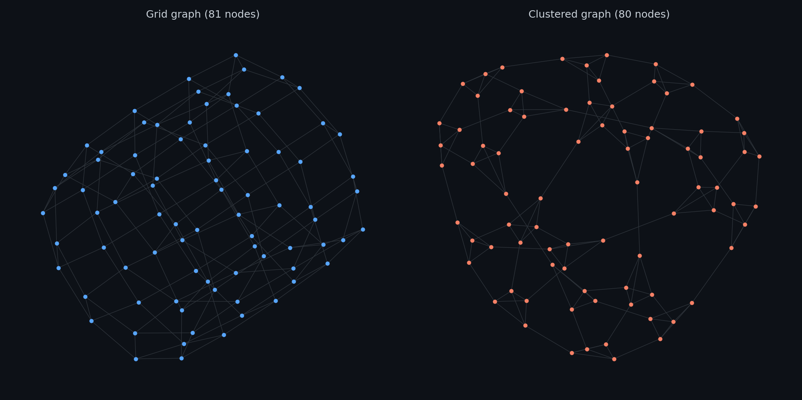
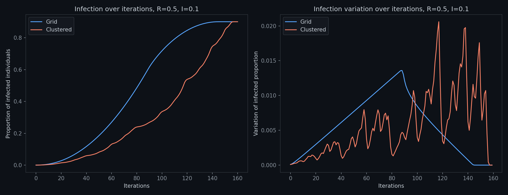
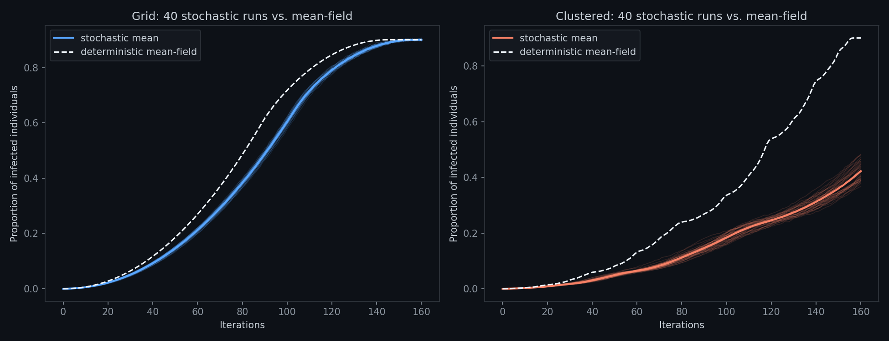
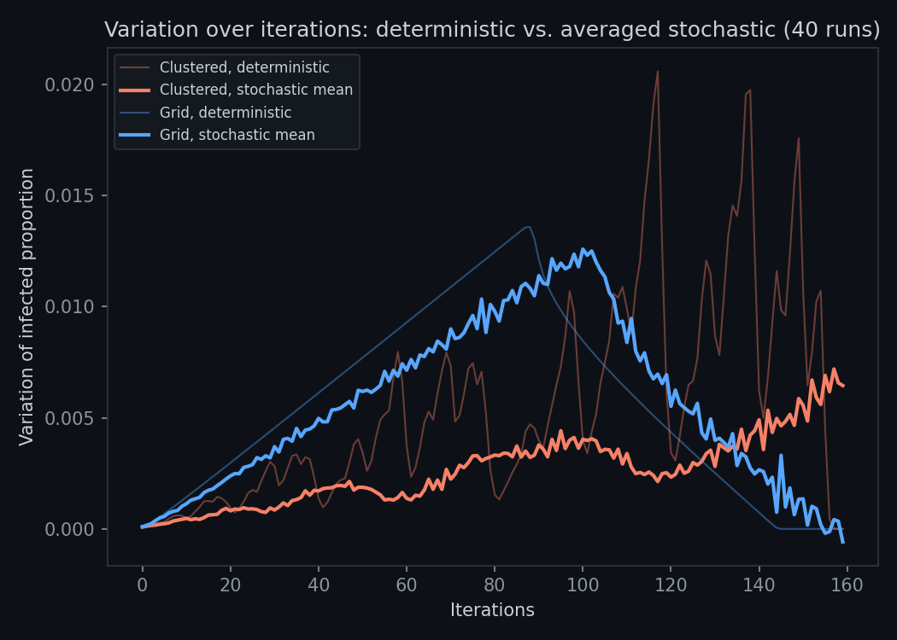

# Epidemic Topology

An SIS model run on two networks with identical degree and similar size, differing only in structure — isolating whether topology alone changes how a disease spreads.

## Two ways to arrange the same number of contacts

<p align="center"></p>

Both networks are exactly 4-regular (every node has 4 neighbors) and close in size (~20,450 nodes):

- **Grid** — a torus-wrapped lattice. No two neighbors of a node are ever neighbors of each other (clustering coefficient = 0).
- **Clustered** — built by recursively replacing every node with a small clique. Neighbors are tightly interconnected (clustering coefficient = 0.5).

Average shortest path length is nearly identical between them (4.50 vs 4.82) — so if propagation differs, it isn't because one network makes distant people harder to reach.

## The transmission rule

$$P_{x,n+1} = P_{x,n}(1-I) + (1-P_{x,n})\left(1 - \prod_{k=1}^{V} (1 - R \, P_{k,n})\right)$$

Each node's infection probability $P_{x,n}$ updates from its own state and its neighbors' ($R$ = transmission probability per contact, $I$ = recovery probability, $V$ = neighbors of $x$) — a standard deterministic mean-field approximation, not individuals.

## Propagation dynamics

<p align="center"></p>

Same model, same parameters, same seed — the grid infects in a clean sigmoid, the clustered network is slower and its rate of change stays noisy throughout.

---

## Stochastic validation

The mean-field formula assumes each neighbor's contribution is independent — exactly what dense clustering violates. Re-running the same rule as a real stochastic process (genuine infected/susceptible states, coin-flip transmission and recovery, 40 runs per network) tests that directly.

<p align="center"></p>

On the grid, the stochastic mean tracks the deterministic curve closely. On the clustered network it doesn't: the deterministic model predicts ~90% infected by iteration 160, the stochastic mean only ~43%.

<p align="center"></p>

Averaging the stochastic runs also smooths out nearly all the jagged variation seen in the deterministic clustered curve — that noise was a synchronous-update artifact, not a real effect. Propagation is genuinely, smoothly slower on the clustered network; the deterministic model got both the smoothness and the speed wrong.

---

## Code

```
code/generate_figures.py   — graph construction, deterministic + stochastic simulation, every figure above
```

```bash
python code/generate_figures.py
```

Requires `networkx`, `numpy`, `matplotlib`. Runs in under a minute.
