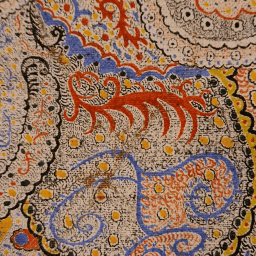

# Feedback Loop

A Stable Diffusion VAE (`stabilityai/sd-vae-ft-mse`) is used to repeatedly re-encode and decode an image, feeding each output back in as the next input. The VAE's reconstruction is not perfectly lossless, so every pass introduces a small error; with no ground truth to correct back to, that error compounds over iterations until the image drifts away from the original.

---

## Result: Umbelliferae

<p align="center"></p>

Photo of an Umbelliferae flower head, backlit at night. Run for 256 iterations with `noise_std = 0.05`. The silhouette stays recognizable for roughly the first half of the run before breaking down into a grainy, saturated texture.

---

## How it works

1. **Crop & resize** — each source image is center-cropped to a square and resized to 256×256.
2. **Encode → sample → decode** — the image is mapped to the VAE's latent distribution, a sample is drawn, and it's decoded straight back into pixel space.
3. **Repeat** — the decoded frame is fed back in as the next input, saving every frame.

`noise_std` controls how much Gaussian noise is injected between rounds (0 disables it). It was 0 for the three results below, and 0.05 over 256 iterations for the result above.

---

## Code

```
code/feedback_loop_static_image.ipynb   — the pipeline: loads a folder of images, runs the encode/decode loop, exports gif + mp4 per image
```

Requires `torch`, `diffusers`, `opencv-python`, `imageio`. The VAE weights (`stabilityai/sd-vae-ft-mse`) are pulled automatically from Hugging Face on first run.

---

## More results

50 iterations, `noise_std = 0`.

### Ink sketch

<p align="center"></p>

Pen-and-ink drawing. Being pure black-and-white linework, it breaks down fastest — the network has no prior for flat line art, so within a handful of iterations the strokes turn into a noisy wash of color, with only faint darker blotches marking where the original lines were.

### Paisley painting

<p align="center"></p>

Detail of a paisley painting with a scrollwork dragon motif, made of dense dot stippling. The high-frequency dot pattern aliases through the latent bottleneck, and by around iteration 15 the motif is gone, replaced by a dense weave of color streaks.

### Persian rug

<p align="center"></p>

Macro shot of a woven rug's repeating figures. Despite the strong symmetry, it degrades fastest of the three — by iteration 15 the figures and borders are gone, replaced by vertical streaks of color that get grainier over the remaining iterations.
