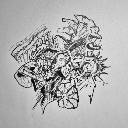
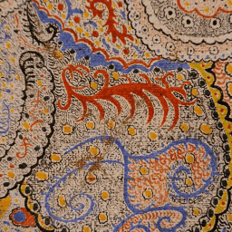
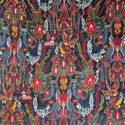

# Feedback Loop

> *What does a picture dream about, when you keep asking a VAE to imagine it again?*

A Stable Diffusion VAE (`stabilityai/sd-vae-ft-mse`) is a vision encoder/decoder trained to compress an image into a small latent code and reconstruct it losslessly enough to fool the eye. This project abuses that reconstruction: instead of encoding once, an image is repeatedly re-encoded and decoded, feeding each output back in as the next input, with a small amount of Gaussian noise injected between iterations to keep the loop from freezing solid. Encoder error and injected noise compound iteration after iteration, and the picture drifts from a faithful copy of itself into something the network invents on its own.

---

## Result: Queen Anne's lace


A backlit flower head, photographed at night, run through 50 iterations of the encode → noise → decode loop. Its silhouette is unusually durable — the bright bloom against a near-black background stays recognizable well past the halfway point — but the injected noise compounds into a saturated, grainy cyan glow, and by the last frames the flower has curdled into a hallucinated texture that only vaguely traces the original shape.

---

## How it works

1. **Crop & resize** — each source image is center-cropped to a square and resized to 256×256.
2. **Encode → sample → decode** — the image is mapped to the VAE's latent distribution, a sample is drawn, and it's decoded straight back into pixel space.
3. **Inject noise** — before the next round, small Gaussian noise (σ = 0.05) is added to the decoded frame.
4. **Repeat** — 50 times, saving every frame.

Each run is exported as an animated GIF/MP4 so the drift is visible as motion rather than a single before/after pair.

---

## Code

```
code/feedback_loop_static_image.ipynb   — the full pipeline: loads a folder of images, runs the encode/noise/decode loop, exports gif + mp4 per image
```

Requires `torch`, `diffusers`, `opencv-python`, `imageio`. The VAE weights (`stabilityai/sd-vae-ft-mse`) are pulled automatically from Hugging Face on first run.

---

## More results

### Ink sketch



A dense pen-and-ink drawing. Being pure black-and-white linework, it's the harshest test of the VAE's photographic prior — the network has no vocabulary for flat line art, so within a handful of iterations the strokes erupt into a garish, grainy wash of blues, pinks, and greens, with only faint ghosts of the original shapes surviving as darker blotches.

### Paisley textile



A close-up of a hand-painted, dotted paisley pattern with a scrollwork dragon motif. The regular, high-frequency stippling aliases heavily through the latent bottleneck, and within about 15 iterations any trace of the original motif is gone, replaced by a dense, glitchy weave of clashing color streaks.

### Persian rug



A macro shot of a woven rug's repeating figures. Despite the strong symmetry, it's the fastest of the four to fall apart — by frame 15 the animals and borders are already gone, dissolved into vertical streaks of clashing color that only get grainier and more saturated over the remaining iterations.
