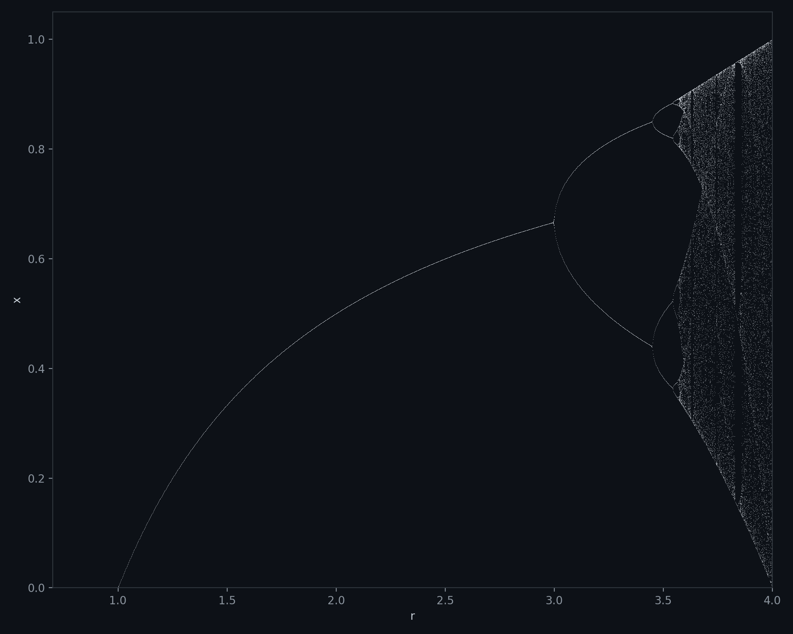

# Logistic Transients

> *A bug in an R script that plotted the wrong part of the sequence — and looked better for it.*

The [logistic map](https://en.wikipedia.org/wiki/Logistic_map) $x_{n+1} = r x_n (1 - x_n)$ is usually visualized with a bifurcation diagram: for each $r$, iterate the map many times, throw away the first hundred or so iterations (the *transient*), and plot only the values it settles into (the *attractor*). That's the classic fractal-looking tree.

An R script written to do exactly this had a bug: instead of discarding the transient and keeping the tail, it kept a rolling window of the **first 40 iterations** and plotted those — the part that's normally thrown away. The result isn't the textbook diagram; it's the transient's own geometry, laid bare.

---

## The bug's output


Every point is colored by its step index (1st iterate, 2nd iterate, ... 40th), all starting from the same $x_0 = 0.99999$. Each colored arc is one iteration step traced across every value of $r$ — that's why fanning, layered curves appear where a normal bifurcation diagram just shows a single line splitting in two.

## What it's supposed to look like



Same map, same range of $r$, but keeping only the converged tail (after a 500-step warm-up) instead of the first 40 steps. This is the standard bifurcation diagram: a single stable value up to $r=3$, period-doubling into chaos beyond it.

---

## Code

```
code/bifurc_logistique.R      — the original script, bug included
code/generate_figures.py      — Python port, reproduces both figures above
```

```bash
python code/generate_figures.py
```

Requires `numpy` and `matplotlib`.
