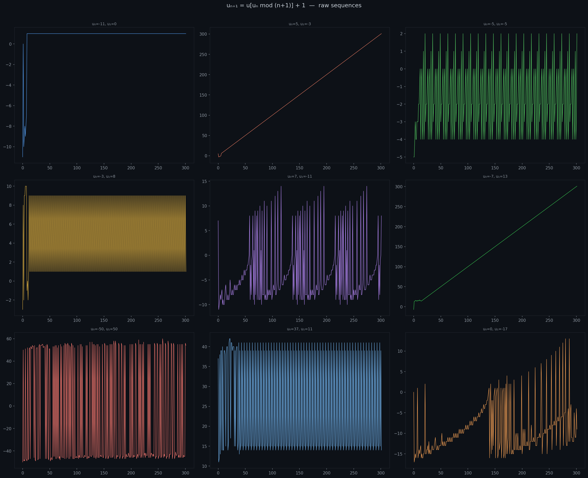
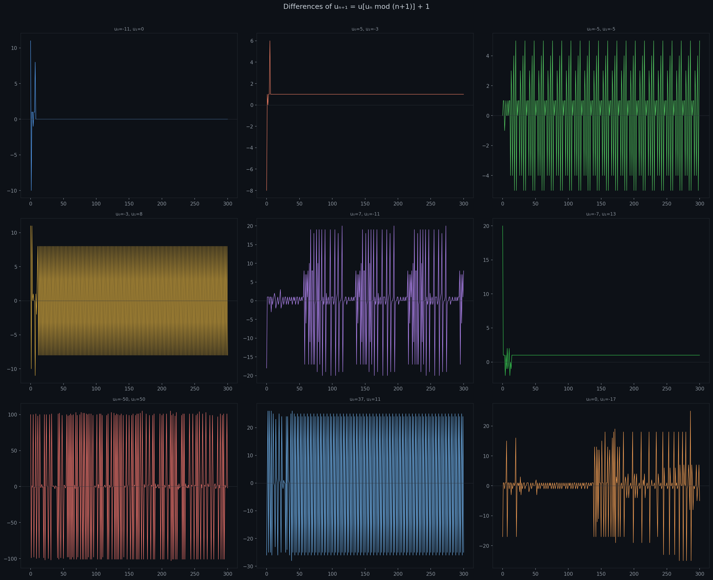
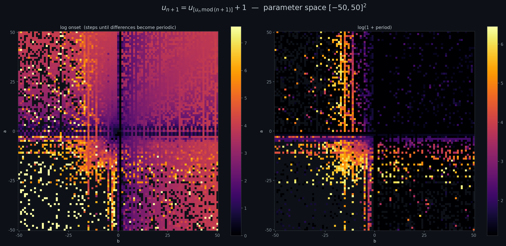

# Meta-Recurrence

> *What happens when a sequence looks up its own past to decide its future?*

Inspired by **Langton's Ant** and similar systems where chaotic behaviour abruptly crystallises into order, this project studies a self-referential recurrence:

$$u_{n+1} = u_{\,u_n \bmod (n+1)} + 1$$

The sequence uses its own current value as an *index* into its own history. The $+1$ perturbation prevents the sequence from getting stuck in the trivially defined initial values. The result is a dynamical system that is surprisingly rich: some seeds wander chaotically, others collapse into tight periodic orbits within a handful of steps.

---

## Raw sequences

Nine pairs of initial conditions $(u_0, u_1)$, each evolved for 300 steps.



The trajectories look erratic at first glance, but something quieter is happening underneath.

---

## Difference sequences

Plotting $\Delta u_n = u_{n+1} - u_n$ makes periodic behaviour visible — a flat or repeating difference pattern signals that the sequence has locked into a loop.



Most seeds stabilise; the differences settle into a repeating pattern well before step 300.

---

## Parameter space

Sweeping $(u_0, u_1) \in [-50, 50]^2$ and running each sequence for 2000 steps, we record two quantities:

- **Onset** — how many steps before the differences become periodic
- **Period** — the length of the eventual cycle



Both are shown on a log scale. The structure is far from random: bands, voids, and sharp boundaries appear across the grid, hinting at deep arithmetic constraints on which initial conditions lead to fast vs slow stabilisation.

---

## Zoomed positive quadrant

The positive quadrant $(u_0, u_1) \in [0, 200]^2$ is cool. Using the colour map $5^{\log(\text{onset})}$ to stretch the contrast:


---

## Code

```
code/generate_figures.py   — reproduces all figures above
figures/                   — output directory
```

```bash
python code/generate_figures.py
```

Requires `numpy` and `matplotlib`.
