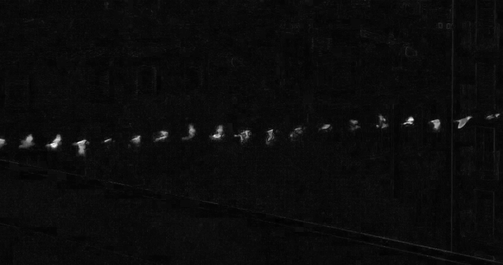
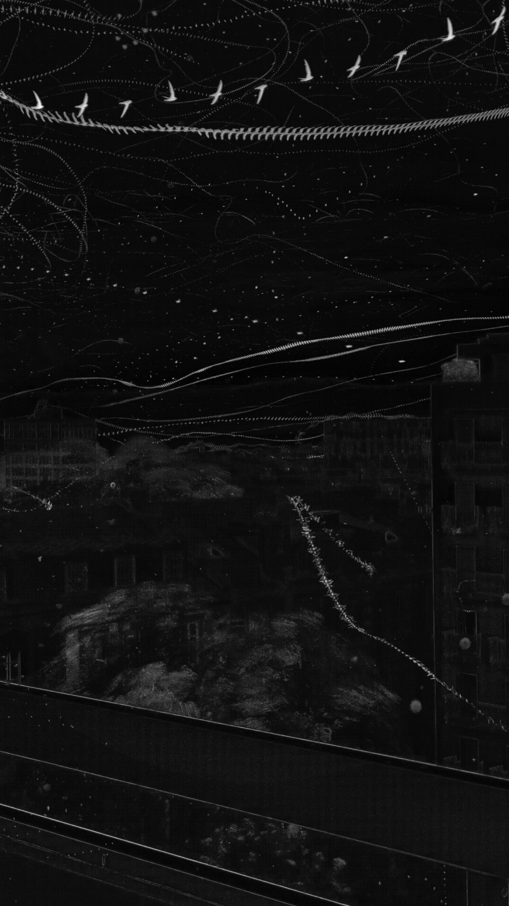

# Motion Heatmap

For each pixel in a video, find the frame where it changed the most (largest frame-to-frame difference), and keep that frame's timestamp. Fast-moving subjects against a static background leave a bright trail — more recording time, more trails.

<p align="center"></p>

A short clip: a handful of birds crossing.

<p align="center"></p>

9 minutes of recording: dozens of birds and passing wires accumulate into a dense web of motion.

## Code

```
max_delta_frame.py   — computes the max-delta heatmap from a video, parallelized across CPU cores
```

```bash
python max_delta_frame.py video.mp4 -o output.png --preview heatmap.png
```

Requires `opencv-python`, `numpy`.
