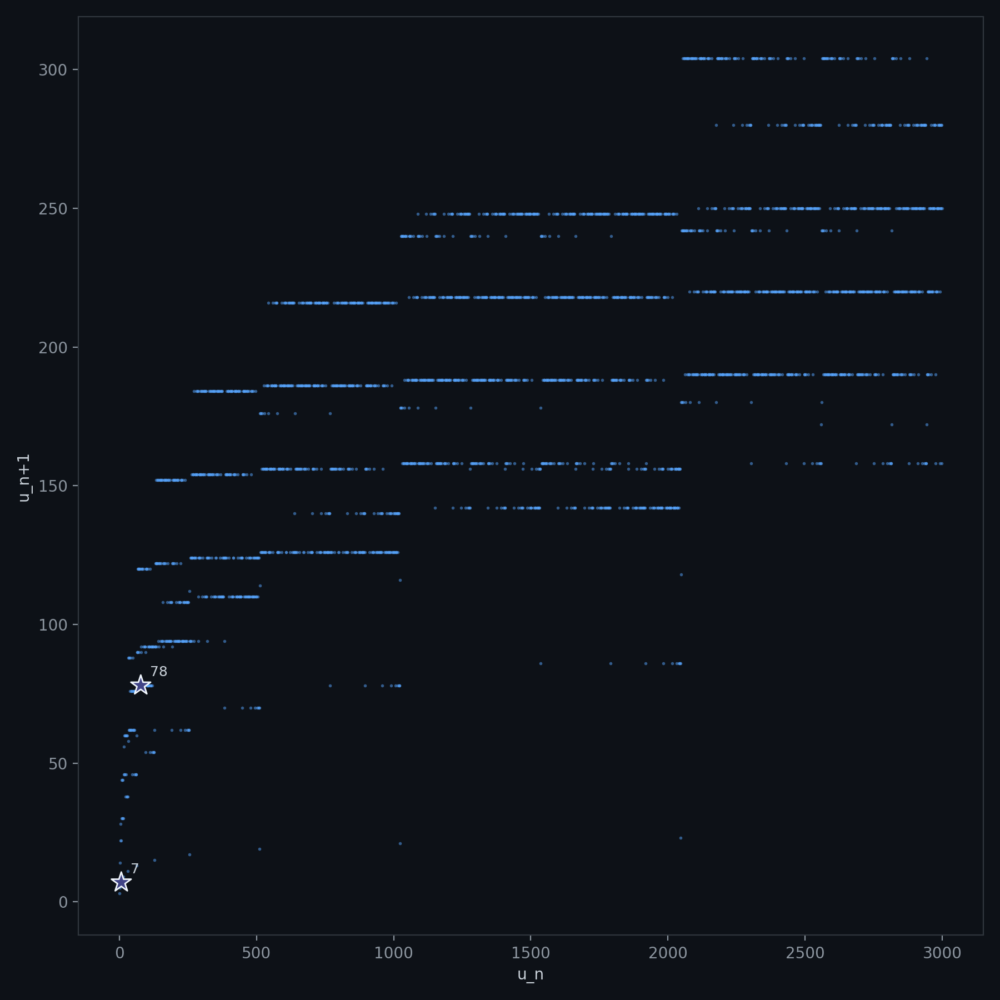
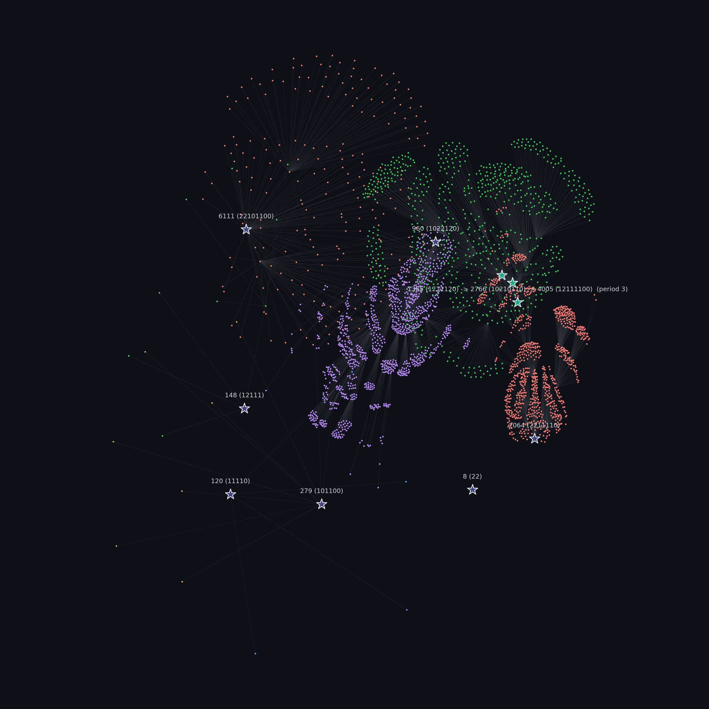
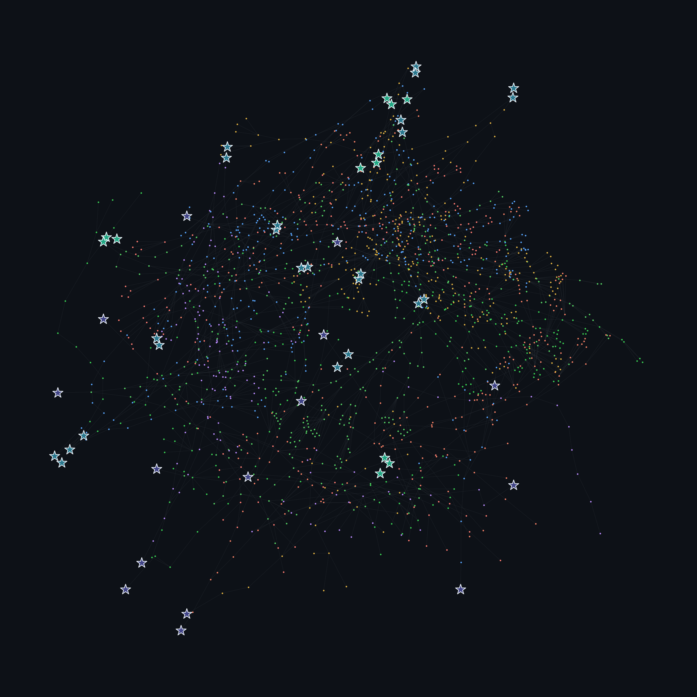
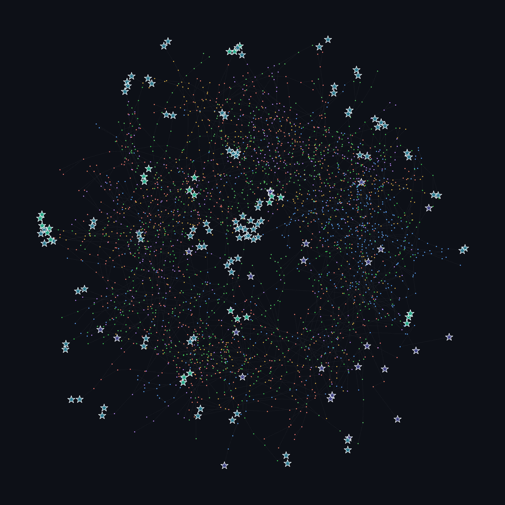

# Pea Pattern

A variation on the [look-and-say sequence](https://oeis.org/A005150): instead of reading off consecutive runs of digits, count how many times each *distinct* digit appears in the whole number, then write those counts down from the largest digit present to the smallest.

$$x_{n+1} = \mathcal{P}_k(x_n)$$

Every number in base $k$ eventually settles into a fixed point or a short cycle — noticed here by running the numbers, and turning out to already be a known, named, published result: this transformation is called the **Pea Pattern sequence**, studied by André Pedroso Kowacs in [*Studies on the Pea Pattern Sequence*](https://arxiv.org/abs/1708.06452), which proves convergence in general and tabulates every fixed point and cycle for bases 2 through 10.

---

## Full example

Starting from $19$ in base 2 (`10011`):

| step | value | binary | digit counts (desc.) |
|---|---|---|---|
| $x_0$ | 19  | `10011`  | three `1`s, two `0`s |
| $x_1$ | 60  | `111100` | four `1`s, two `0`s |
| $x_2$ | 76  | `1001100` | three `1`s, four `0`s |
| $x_3$ | 120 | `1111000` | four `1`s, three `0`s |
| $x_4$ | 78  | `1001110` | **fixed point** |

At each step: the digit `1` appears, say, 3 times, so that contributes `11` (3 in binary) followed by `1`, i.e. `111`; the digit `0` appears 2 times, contributing `10` followed by `0`, i.e. `100`. Concatenating the `1`-block before the `0`-block (larger digit first) gives the next value: `111` + `100` = `111100` = 60. Repeating this lands on 78 after 4 steps, one of only two fixed points that exist in base 2.

---

## Base 2: only two stable values

Base 2 is the striking case. Every positive integer, run through this transformation repeatedly, converges to one of exactly two fixed points: **7** (`111`) or **78** (`1001110`) — confirmed by exhaustive search here, and matching the paper's own table for $k=2$ exactly.

The two fixed points aren't symmetric, though. Working out which numbers can map to $7$: for the output of one step to equal `111`, the *input* must consist of a single repeated digit (so that only one count-block gets emitted), and that block has to itself spell out `111`. The only word satisfying this is `111` itself. So **7 has no predecessors at all** — it is reachable only by starting there. Every other starting number, without exception, converges to 78.

<p align="center"></p>

A force-directed layout (Fruchterman-Reingold) of every number reached while iterating $\mathcal{P}_2$ from starting values $1..3000$; an edge connects a number to what it maps to next. The whole graph collapses onto two roots — a lone, unreachable `7`, and `78`, which absorbs everything else.

## Return map

<p align="center"></p>

Every pair $(u_n, u_{n+1})$ produced while exploring base 2, plotted against each other. Stationary points (values that map to themselves, or that sit on a longer cycle) are marked with a star, colored on a gradient by the length of the cycle they belong to. In base 2 both stable points are ordinary fixed points — a cycle of length 1 — so the gradient collapses to a single color here; the bases below actually have longer cycles, where the color gradient starts to matter.

---

## More bases

The same force-directed layout, for a few other bases. Star color encodes the period of the cycle it sits on (longer cycles get a different shade); dot color groups numbers by which basin they eventually fall into.

### Base 3

<p align="center"></p>

Base 3 has seven distinct fixed points **and** an actual 3-cycle — `10210110 → 12111100 → 1212120 → 10210110` — visible as three co-equal, differently-shaded stars rather than a single hub.

### Base 10 and base 15

<p align="center"></p>
<p align="center"></p>

These bases have far more fixed points and cycles than 2 or 3, so individual labels are omitted for legibility — but the same encoding still applies: dot color marks which basin a number falls into, star color marks the period of the cycle it landed on.

---

## Code

```
code/generate_figures.py   — the transformation, the search, and every figure above
```

```bash
python code/generate_figures.py
```

Requires `networkx` and `matplotlib`.
