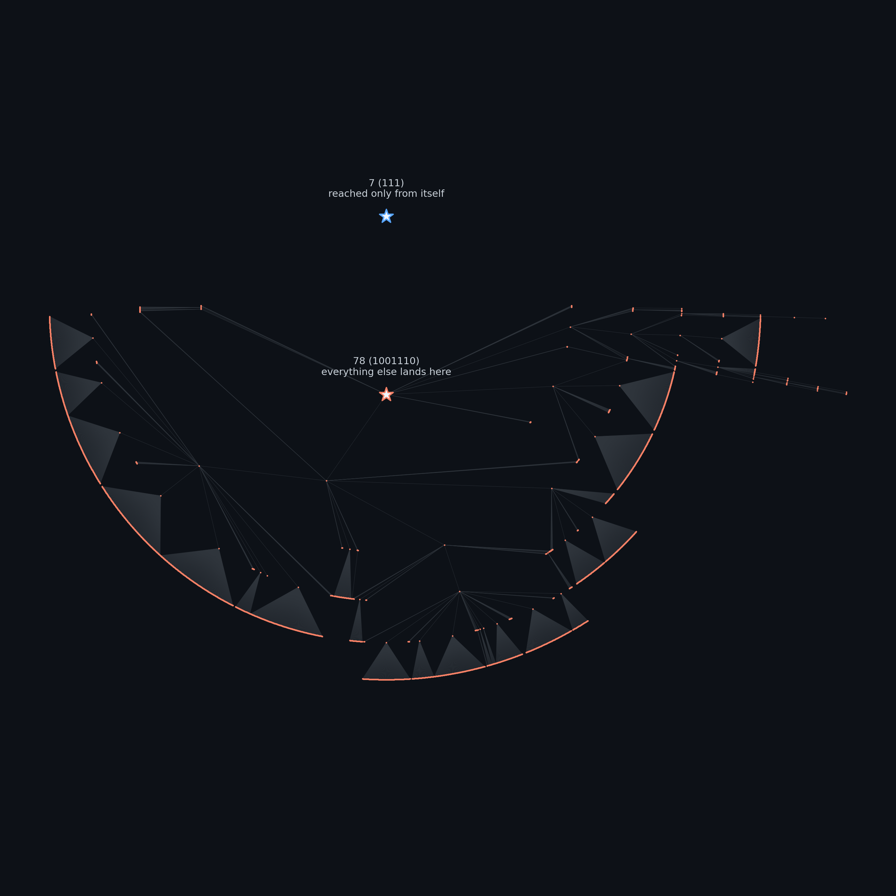
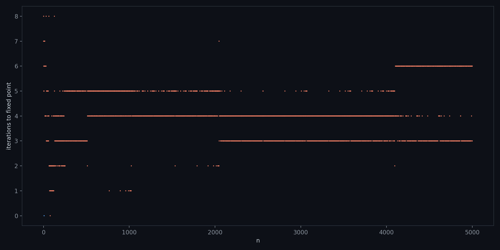

# Pea Pattern

A variation on the [look-and-say sequence](https://oeis.org/A005150): instead of reading off consecutive runs of digits, count how many times each *distinct* digit appears in the whole number, then write those counts down from the largest digit present to the smallest.

$$x_{n+1} = \mathcal{P}_k(x_n)$$

For example in base 10, starting from $123$: the digits $3,2,1$ each appear once, so reading from largest to smallest gives $1\,3\,1\,2\,1\,1 = 131211$. One more step gives $131241$, and so on.

Every number in base $k$ eventually settles into a fixed point or a short cycle — noticed here by running the numbers, and turning out to already be a known, named, published result: this transformation is called the **Pea Pattern sequence**, studied by André Pedroso Kowacs in [*Studies on the Pea Pattern Sequence*](https://arxiv.org/abs/1708.06452), which proves convergence in general and tabulates every fixed point and cycle for bases 2 through 10.

---

## Base 2: only two stable values

Base 2 is the striking case. Every positive integer, run through this transformation repeatedly, converges to one of exactly two fixed points: **7** (`111`) or **78** (`1001110`) — confirmed by exhaustive search here, and matching the paper's own table for $k=2$ exactly.

The two fixed points aren't symmetric, though. Working out which numbers can map to $7$: for the output of one step to equal `111`, the *input* must consist of a single repeated digit (so that only one count-block gets emitted), and that block has to itself spell out `111`. The only word satisfying this is `111` itself. So **7 has no predecessors at all** — it is reachable only by starting there. Every other starting number, without exception, converges to 78.



Each dot is a number reached while iterating $\mathcal{P}_2$ from some starting value in $1..3000$; an edge connects a number to what it maps to next. The whole graph collapses onto two roots — a lone, unreachable `7`, and `78`, which absorbs everything else.

## How fast it converges



Number of iterations before hitting a fixed point, for $n = 1..5000$. The banding shows the same discreteness seen in the graph above: convergence is fast (almost always under 10 steps) and clusters into a handful of exact iteration counts rather than growing smoothly with $n$.

---

## Code

```
code/generate_figures.py   — the transformation, the search, and both figures above
```

```bash
python code/generate_figures.py
```

Requires `matplotlib`.
