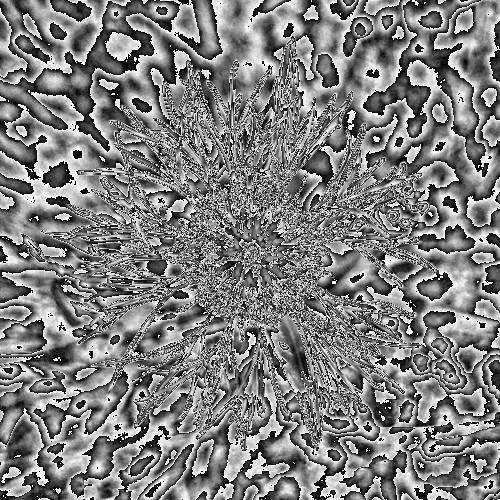

# Picture Effects

Three small image-processing experiments, each run on the same two source photos — a close-up eye and a wildflower — so the effects are easy to compare side by side.

Source photos live in [`sources/`](sources/).

---

### [Modulo Stripes](modulo-stripes/)

Grayscale brightness taken modulo a fixed value, turning smooth edges into topographic-map-style contour bands.

---

### [Gradient Drift](gradient-drift/)

A grid of dots pushed along the image's brightness-gradient field, converging into flowing lines that trace its edges.

---

### [PCA Relief](pca-relief/)

PCA on each pixel's RGB color, using the second principal component as terrain height — turning the photo into a 3D landscape colored by its own palette.
