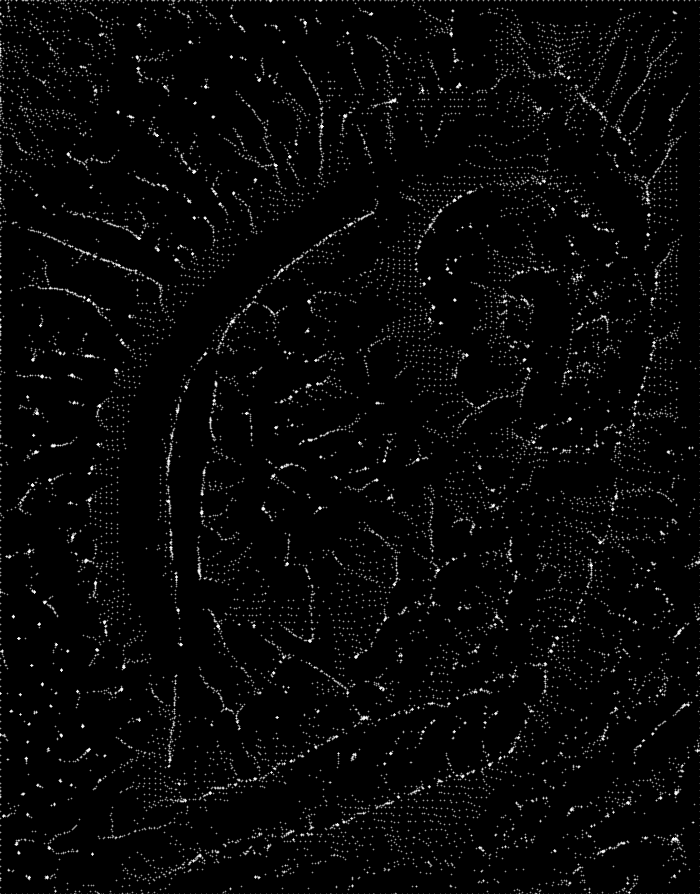
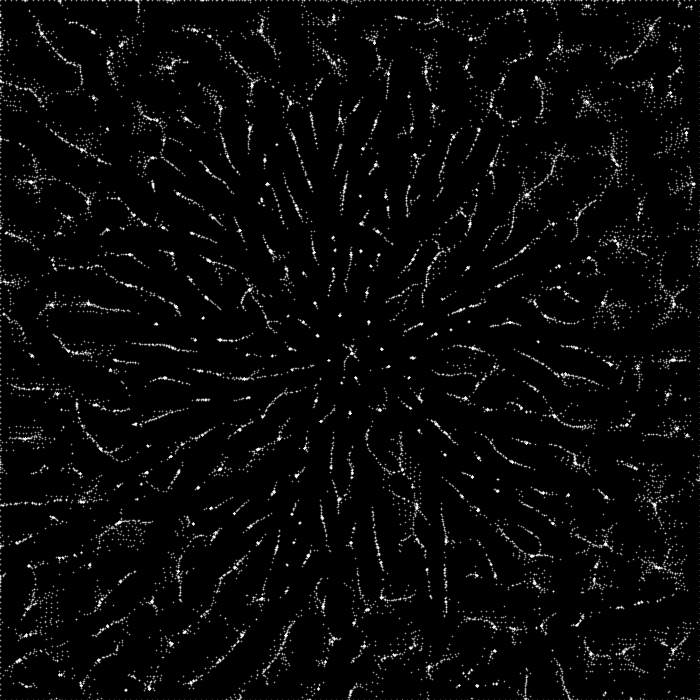
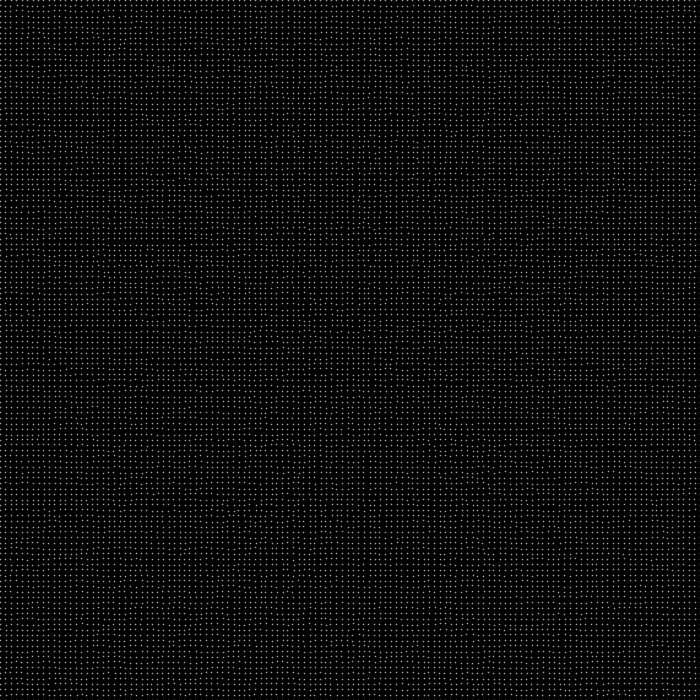

# Gradient Drift

Compute the orientation of the image's brightness gradient at every pixel (via Sobel filters) and treat it as a vector field. Scatter a grid of dots over the image, then repeatedly nudge each dot in the direction of the field at its current position.

Since the gradient always points across an edge, dots starting near an edge get pulled along it, and dots from a wide swath of the image converge onto the same thin paths — even though every dot only ever looks at the field right where it stands. The result traces the image's edges as flowing lines, without ever computing an edge map directly.

---

## Eye




## Flower





---

## Code

```
code/generate_figures.py   — gradient field + dot simulation, static frame and animation
```

```bash
python code/generate_figures.py
```

Requires `numpy`, `matplotlib`, `Pillow`, `scikit-image`, `scipy`. Reads source photos from `../sources/`.
