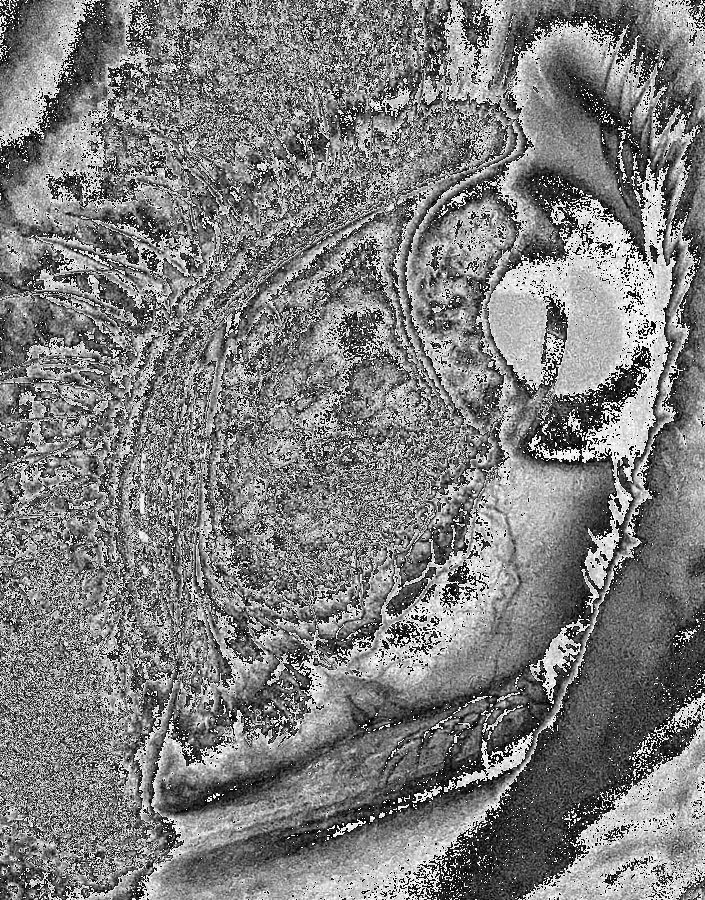
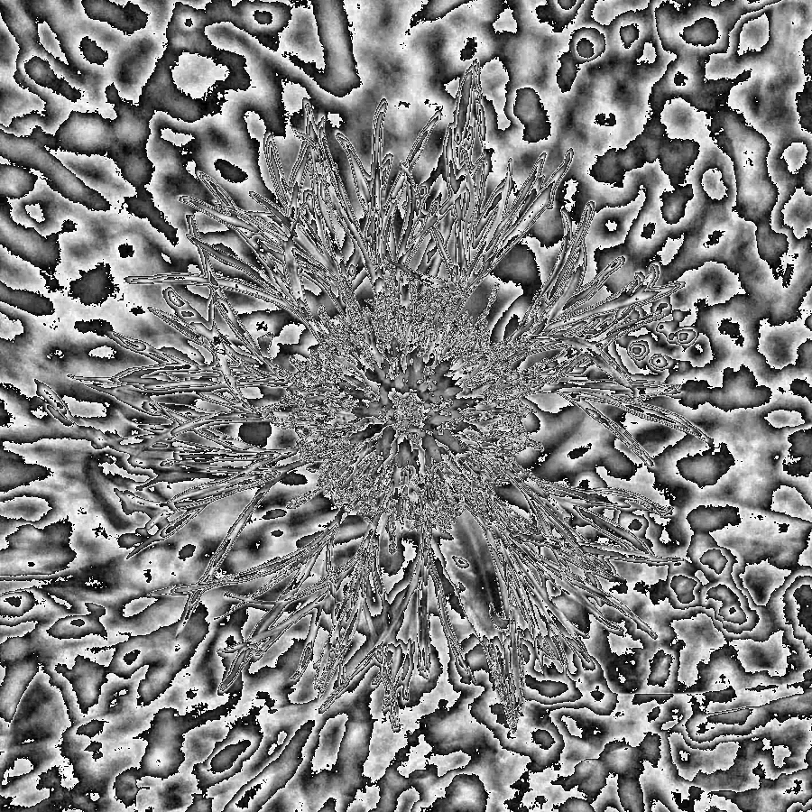

# Modulo Stripes

Convert an image to grayscale, then replace every pixel's brightness $b$ with $b \bmod M$ for some modulus $M$. Brightness that was smoothly increasing across an edge now wraps back to 0 every time it crosses a multiple of $M$, turning smooth gradients into repeating bands — and since the wrap-around happens at a fixed brightness value, the bands trace contour lines around every edge in the image, like a topographic map.

Animating the modulus with a shifting offset — $(b + t) \bmod M$ for increasing $t$ — makes the contour lines crawl across the image over time.

---

## Eye




## Flower




---

## Code

```
code/generate_figures.py   — grayscale + modulo, static image and animated version
```

```bash
python code/generate_figures.py
```

Requires `numpy`, `matplotlib`, `Pillow`. Reads source photos from `../sources/`.
