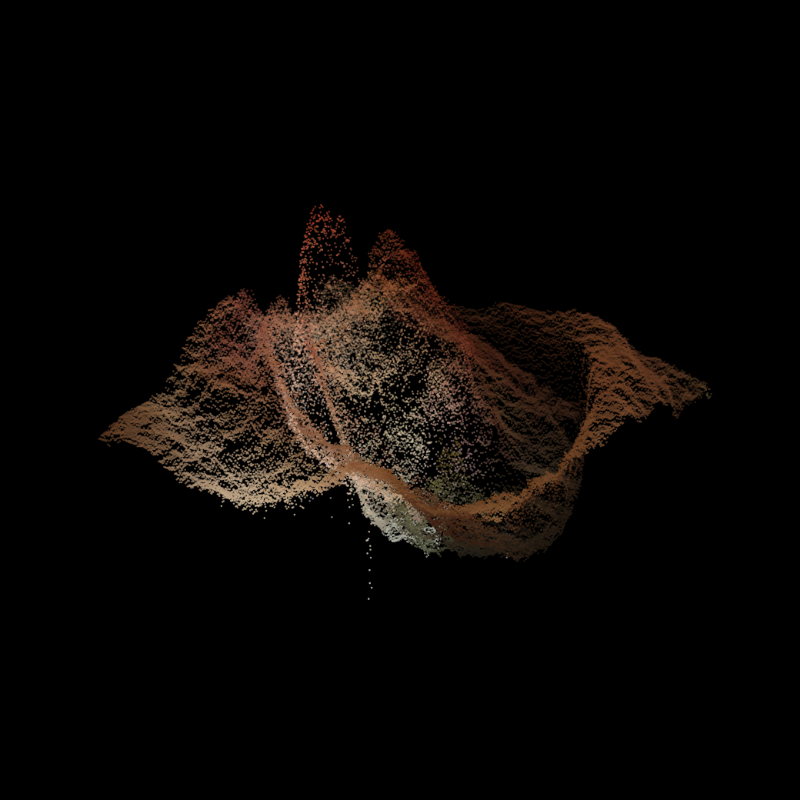
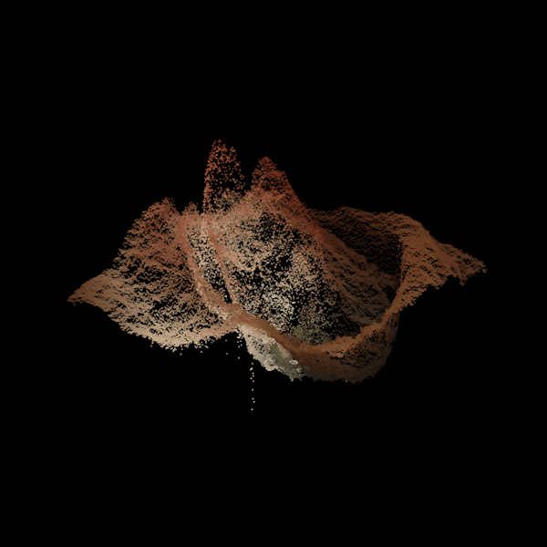
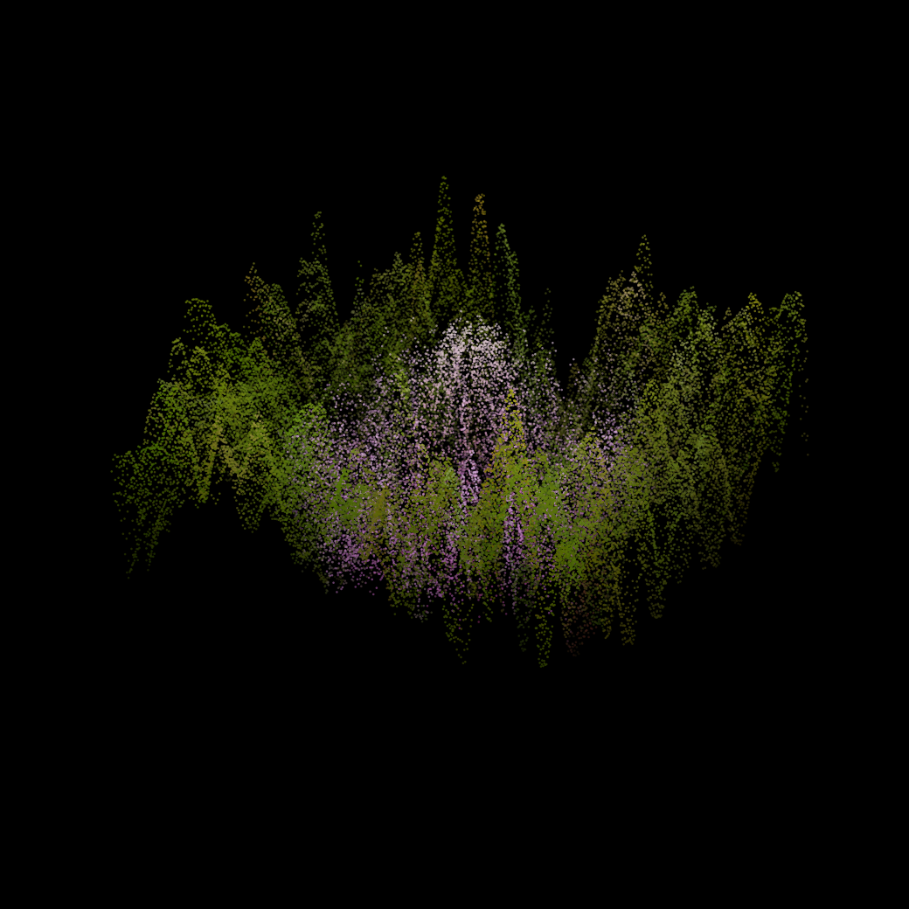

# PCA Relief

Treat every pixel's $(R, G, B)$ as a point in 3D color space, and run PCA across all of an image's pixels. The first component just tracks overall brightness, but the **second principal component** captures the next-biggest axis of color variation — and using it as a height value at each pixel's $(x, y)$ position turns the flat image into a 3D terrain, colored by its own original RGB.

Edges between strongly-contrasting colors become ridges and craters; flat, uniformly-colored regions stay flat.

---

## Eye





[Interactive 3D version](media/eye_relief.html) — download and open in a browser to rotate and zoom.

## Flower




[Interactive 3D version](media/flower_relief.html) — download and open in a browser to rotate and zoom.

---

## Code

```
code/generate_figures.py   — PCA on pixel colors, static + rotating + interactive versions
```

```bash
python code/generate_figures.py
```

Requires `numpy`, `matplotlib`, `Pillow`, `scikit-learn`, `pandas`, `plotly`. Reads source photos from `../sources/`.
